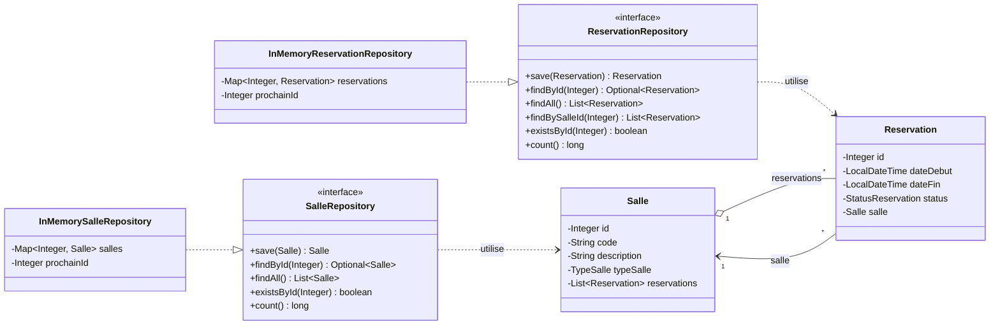

# Diagramme des dependances - Increment v0.4.0 (Repositories en memoire)

Ce diagramme est produit **avant le code** : il fixe la direction des dependances
de la couche d'acces aux donnees. La regle essentielle est l'inversion de
dependance : l'appelant (plus tard un Service) ne connait que les contrats
`SalleRepository` et `ReservationRepository`, jamais leurs implementations
memoire.

## Vue des dependances

## Sens des dependances

| Source | Cible | Type |
| --- | --- | --- |
| `InMemorySalleRepository` | `SalleRepository` | realisation (implements) |
| `InMemoryReservationRepository` | `ReservationRepository` | realisation (implements) |
| `SalleRepository` / `ReservationRepository` | `Salle` / `Reservation` | utilisation |
| `Salle` | `Reservation` | association navigable (1 vers *) |
| `Reservation` | `Salle` | association navigable (* vers 1) |

## Regles retenues

- Les implementations `InMemory*` restent dans le paquet `sn.woy.repository`,
  a cote de leurs contrats.
- Les contrats ne dependent que du domaine (`sn.woy.domain`), jamais de
  `HashMap` ni d'une implementation concrete : c'est ce qui permettra de
  substituer plus tard un stockage JDBC sans modifier les appelants.
- Les collections exposees par les contrats sont documentees comme des copies
  immuables (protection de l'etat interne du repository).
